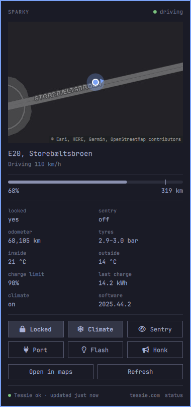

# omarchy-tessie

A bar widget for the Omarchy shell that shows where your Tesla is and lets
you control it, through [Tessie](https://tessie.com).



Click the Tesla **T** in the bar to open the panel:

- your car's name, and a dot for what it is doing (driving, parked,
  charging, asleep)
- a map centred on the car (scroll to zoom, click to open it in a maps app)
- the address, plus the speed or charging power
- battery level and range, with a tick at the charge limit
- locked, sentry, odometer, tyres, inside and outside temperature, charge
  limit, last charge, climate and software version
- toggles for **lock**, **climate**, **sentry** and **charge port**, plus
  **flash** and **honk**. Unlocking asks for a second click.
- a Tessie footer: service status from
  [status.tessie.com](https://status.tessie.com), when Tessie last heard from
  the car, and links to tessie.com and the status page

Middle click refreshes, right click opens the maps link. With the panel
focused, `r` refreshes, `m` opens maps and `Esc` closes it.

## Setup

1. Create an API token at <https://dash.tessie.com/settings/api>.
2. Click the widget and choose **Set up Tessie token**, or run
   `bin/tessie login` in a terminal. The token is checked against Tessie and
   stored in your keyring (`secret-tool`, service `tessie`). Without a keyring
   it goes to `~/.config/omarchy-tessie/token` with mode 0600.

The first car on the account is used unless you set `vin`. The heading is the
name set in the car. An unnamed car shows its model, or set `name`.

## Why reading never wakes the car

The widget reads Tessie's cached state (`use_cache=true`), which never wakes
the car, so polling costs no battery. Only the control buttons wake it. It
polls every `refreshMinutes` while closed and every 30 seconds while open.

## Settings

Set these on the widget's entry in `~/.config/omarchy/shell.json`:

| Key              | Default                  | Meaning                                     |
|------------------|--------------------------|---------------------------------------------|
| `name`           | the car's name, or model | Panel heading                               |
| `vin`            | first car on the account | Which car to show                           |
| `units`          | follows the car          | `metric` or `imperial`                      |
| `refreshMinutes` | `5`                      | Poll interval while the panel is closed     |
| `mapZoom`        | `16`                     | Starting map zoom, 3 to 16 (19 with a key)  |
| `cartoKey`       | none                     | Use CARTO's basemaps, see below             |
| `mapsUrl`        | Google Maps              | Maps link template with `{lat}` and `{lon}` |
| `demo`           | `false`                  | Show a made-up car and never call Tessie    |

For example:

```
omarchy bar set io.github.kimm-stensborg.tessie name "Sparky"
omarchy bar set io.github.kimm-stensborg.tessie demo true --json
omarchy bar set io.github.kimm-stensborg.tessie mapsUrl "https://www.openstreetmap.org/?mlat={lat}&mlon={lon}#map=17/{lat}/{lon}"
```

## Map

Out of the box the map uses Esri's gray Canvas basemap, which needs no
signup. For CARTO's darker, sharper basemap (and zoom up to 19), get a free
key at <https://carto.com/basemaps/apikey>. It is emailed to you straight
away and is meant for non-commercial use. Then:

```
omarchy bar set io.github.kimm-stensborg.tessie cartoKey "your-key"
```

## Command line

Everything the widget does goes through `bin/tessie`, so you can run it by hand:

```
bin/tessie login              store a Tessie API token
bin/tessie logout             forget it
bin/tessie vin                print the VIN in use
bin/tessie state              one JSON snapshot of the car
bin/tessie command lock       lock, unlock, start_climate, stop_climate, flash,
                              honk, enable_sentry, disable_sentry,
                              open_charge_port, close_charge_port
```

The panel can also be driven over IPC, for example from a keybinding:

```
omarchy-shell shell toggle io.github.kimm-stensborg.tessie '{}'
```

## Tests

`./test.sh` runs `bin/tessie` against a local mock of the Tessie API and the
formatting, status and map helpers in `Model.js` under node. It never
touches the real API, your keyring or your stored token.

Map tiles © Esri, HERE, Garmin and
[OpenStreetMap](https://www.openstreetmap.org/copyright) contributors, or with
a key © [OpenStreetMap](https://www.openstreetmap.org/copyright) contributors
© [CARTO](https://carto.com/attributions).
